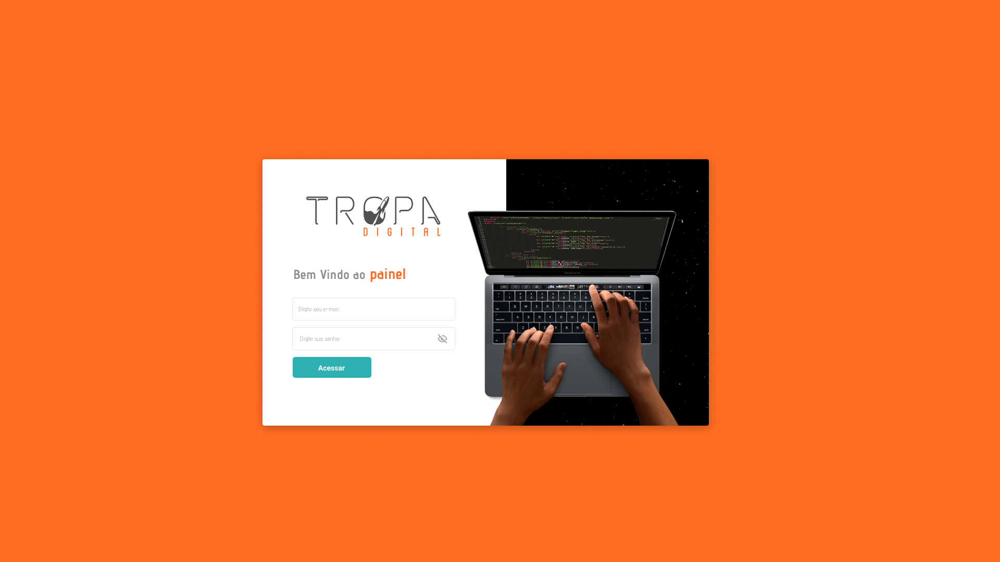

# TROPA DIGITAL

## Desafio M10web - Desenvolvedor Front-End

 

### 🛠 Tecnologias

As seguintes ferramentas foram usadas na construção do projeto:

- [Next.js](https://beta.nextjs.org/docs/routing/pages-and-layouts)
- [TypeScript](https://www.typescriptlang.org/)
- [ChakraUi](https://chakra-ui.com/)

 

### :art: Layout do Projeto

- [Figma](https://www.figma.com/proto/ocGMjVCggf3LGftjTn3XMH/Layout-Front-End?node-id=1%3A2&starting-point-node-id=1%3A2)

 

### 🔗 Deploy

O deploy do projeto foi feito na Vercel, você pode acessar e conferir acessando o link abaixo:

- [Deploy - Vercel](https://tropa-digital-namevug.vercel.app/)

---

 

    

